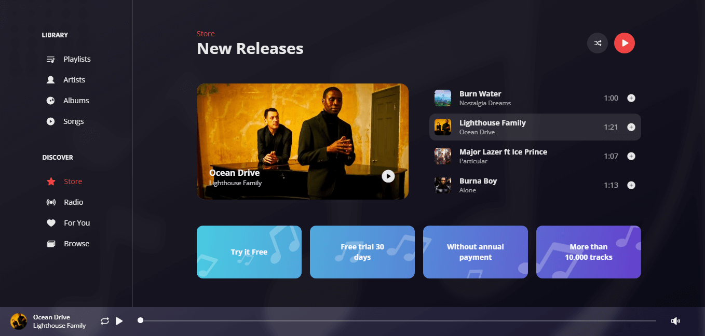

<h1 align="center">Apple iTunes Player Mini Store</h1>

<p align="center"></p>

<h3 align="center">
The frontend implementation of a Music Player UI design, by designer: <a href="https://dribbble.com/shots/5550526-Apple-iTunes-Player-Mini-Store">Aurélien Salomon</a>. Implemented with Vue.js, JavaScript, TailwindCSS.
</h3>

<br>

<h3>
<a href="https://musicplayerx.netlify.app" target="_blank">View it in action.</a>
</h3>
<br>

## Customize configuration

See [Vite Configuration Reference](https://vitejs.dev/config/).

## Project Setup

```sh
npm install
```

### Compile and Hot-Reload for Development

```sh
npm run dev
```

### Compile and Minify for Production

```sh
npm run build
```
